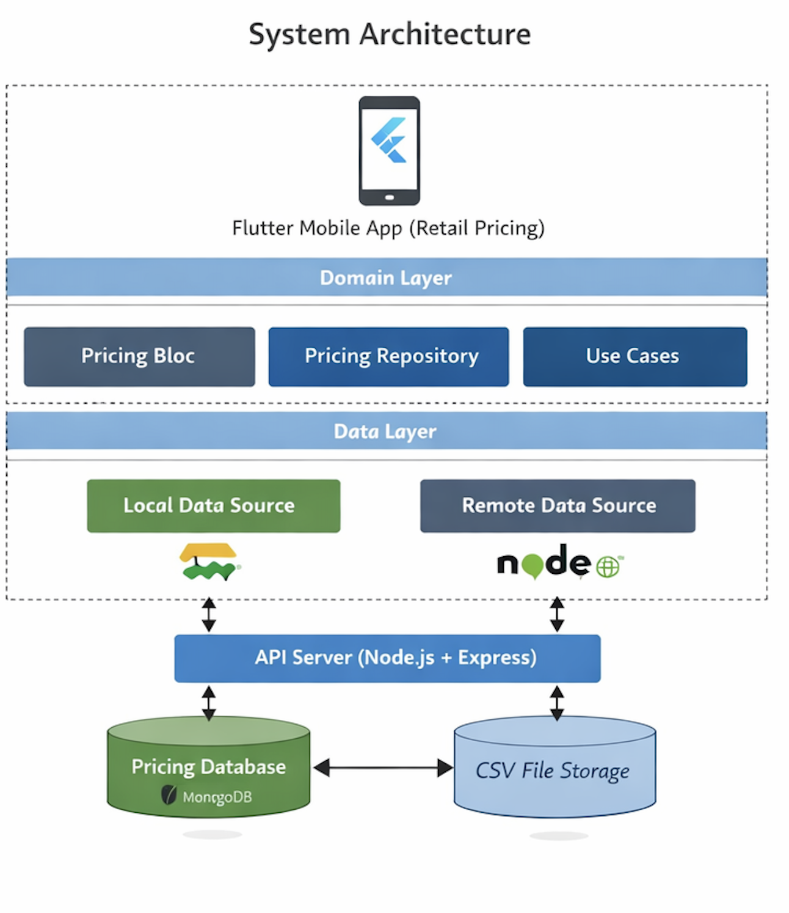
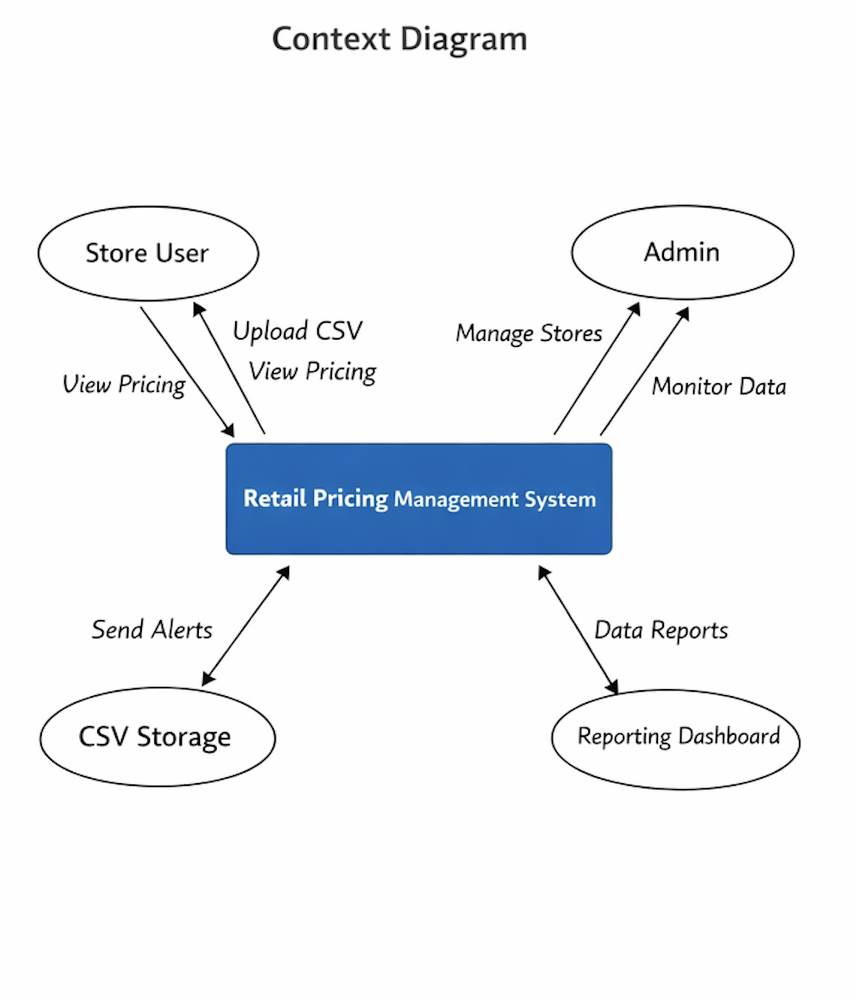
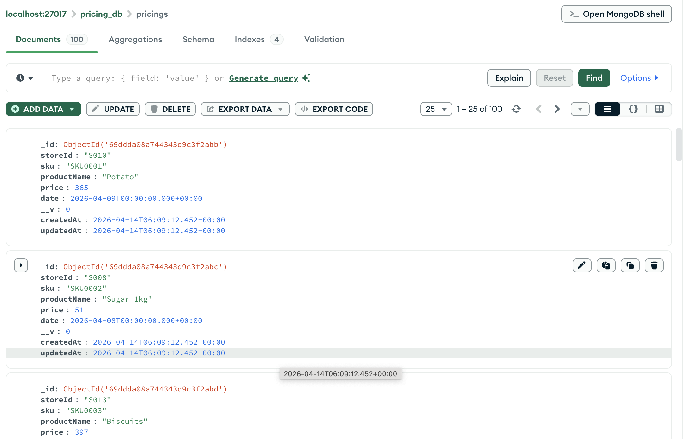
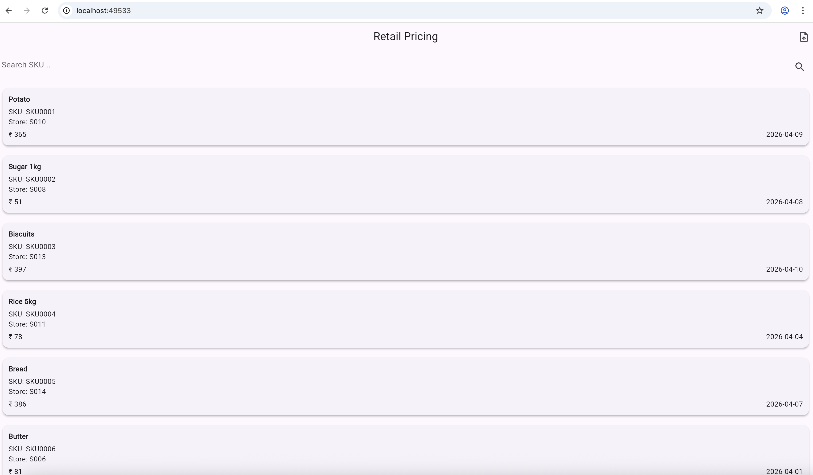
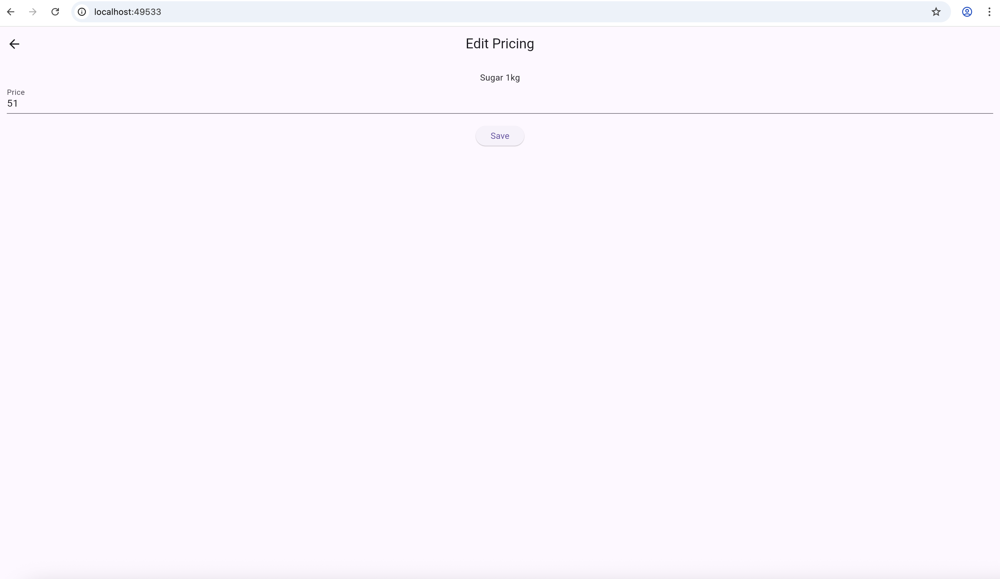

# 🛒 Retail Pricing Management System

A full-stack web application to **upload, manage, search, and edit retail pricing data** across thousands of stores.
Built with **Flutter (Web) + Node.js + MongoDB**, following **Clean Architecture** and **offline-first principles**.

---

## 🚀 Features

### 📂 CSV Upload

* Upload pricing data via CSV
* Bulk ingestion into database
* Supports structured format:

  ```
  Store ID, SKU, Product Name, Price, Date
  ```

### 📋 Pricing List (Card UI)

* Modern card-based UI
* Displays product name, SKU, store, price, and date

### 🔍 Search + Pagination

* Server-side filtering (SKU-based)
* Infinite scroll pagination
* Efficient for large datasets

### 🔄 Pull-to-Refresh

* Refresh data instantly
* Keeps UI in sync with backend

### ✏️ Edit Pricing

* Edit product price
* Update via API using Bloc
* Real-time UI refresh

### 📡 Offline-First Support

* Local caching using Hive
* Data available even without internet

---

## 🏗️ Solution Architecture

This system follows a **client-server architecture**:

### 🔹 Frontend (Flutter Web)

* Clean Architecture:

  * Presentation (UI + Bloc)
  * Domain (Business Logic)
  * Data (Repositories, DataSources)
* State Management: Bloc
* Networking: Dio
* Local Storage: Hive

### 🔹 Backend (Node.js)

* REST API using Express.js
* CSV parsing using streams
* MongoDB for storage
* Supports:

  * Pagination
  * Search
  * Update APIs

---

## 🔄 Data Flow

```
UI → Bloc → Repository → DataSource → API → Database
```

---

## ⚙️ Design Decisions

### ✅ Clean Architecture

* Separation of concerns
* Scalable and testable codebase

### ✅ Bloc Pattern

* Predictable state management
* Handles pagination, search, and updates

### ✅ Dio for API Calls

* Interceptors for logging and error handling
* Production-grade HTTP client

### ✅ Offline-First Strategy

* Cached data using Hive
* Improves reliability in low network

### ✅ Pagination

* Prevents large data loads
* Improves performance and memory usage

---

## 🚀 Non-Functional Requirements

### 🔹 Scalability

* Designed for **3000+ stores across countries**
* Backend horizontally scalable
* Pagination ensures efficient data handling

### 🔹 Performance

* Lazy loading (pagination)
* Optimized queries (MongoDB indexing)
* Reduced payload sizes

### 🔹 Availability

* Offline-first approach
* Data accessible without network

### 🔹 Reliability

* Error handling in Bloc and backend
* Retry mechanisms (extendable)

### 🔹 Security (Future Scope)

* JWT-based authentication
* API validation

### 🔹 Maintainability

* Modular architecture
* Easy to extend features

---

## 📌 Assumptions

* CSV format is consistent and valid
* SKU is unique per store per date
* CSV size is manageable (<5MB)
* Users have access to backend API
* Eventual consistency is acceptable

---

## 📐 Architecture Diagram



---

## 🌐 Context Diagram



---

## 🛠️ Tech Stack

### Frontend

* Flutter (Web)
* Bloc
* Dio
* Hive
* get_it

### Backend

* Node.js
* Express.js
* MongoDB
* Multer (file upload)

---

## ⚙️ Setup Instructions

### 🔹 Backend

```bash
cd Backend
npm install
node server.js
```

Runs on:

```
http://localhost:3000
```

---

### 🔹 Frontend

```bash
cd Frontend
flutter pub get
flutter run -d chrome
```

---

## 📡 API Endpoints

### Upload CSV

```
POST /api/pricing/upload
```

### Get Pricing (Pagination + Search)

```
GET /api/pricing?page=1&limit=20&sku=ABC
```

### Update Pricing

```
PUT /api/pricing/:id
```

---

## 🎯 Future Enhancements

* ✅ Offline sync queue
* ✅ Optimistic UI updates
* ✅ CSV validation before upload
* ✅ Authentication (JWT)
* ✅ Docker deployment
* ✅ CI/CD pipeline

---

## 👨‍💻 Author

**Babu Ali**
Flutter Developer | 9+ Years Experience

---

## ⭐ Key Highlights

* Clean Architecture implementation
* Offline-first design
* Scalable pagination system
* Full CRUD with Bloc
* Production-ready structure

---

## 💡 Interview Talking Point

> “I designed this system with scalability and offline-first capabilities in mind, ensuring it can handle large datasets across multiple stores efficiently.”

---

## 📐 Screenshots






